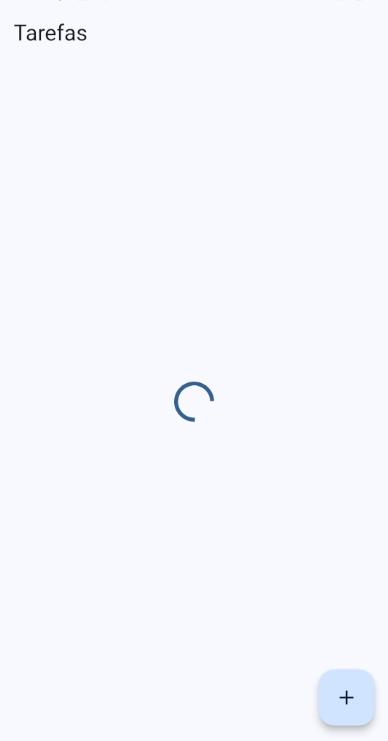
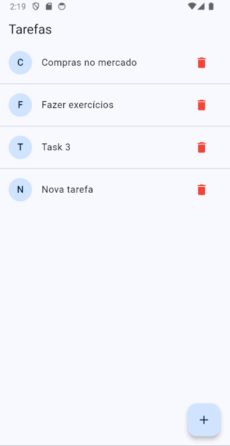

# Flutter Todo App with BLoC Pattern

This project is a simple Todo application built using Flutter and the BLoC (Business Logic Component) pattern. It demonstrates how to manage state in Flutter applications using streams and the BLoC pattern with flutter_bloc and bloc packages.

## Features

- Add, delete, and list tasks.
- State management using BLoC pattern.
- Asynchronous data fetching and updating.

## Project Structure

- `lib/`
  - `main.dart`: The entry point of the application.
  - `app/`
    - `data/`
      - `blocs/`: Contains the BLoC (Business Logic Component) for managing task state.
        - `task_bloc.dart`: Defines the TaskBloc for handling task events and states.
        - `task_event.dart`: Defines the events handled by TaskBloc.
        - `task_state.dart`: Defines the states emitted by TaskBloc.
      - `models/`: Contains the data model.
        - `task_model.dart`: Defines the Task model.
      - `repositories/`: Contains the repository for managing task data.
        - `task_repository.dart`: Simulates a data repository for tasks.
    - `pages/`: Contains the UI pages.
      - `task_page.dart`: The main page displaying the list of tasks.
- `test/`
  - `task_bloc_test.dart`: Contains tests for TaskBloc.

## Getting Started

To run this project, ensure you have Flutter installed on your machine.

1. Clone the repository.
2. Navigate to the project directory.
3. Run `flutter pub get` to install dependencies.
4. Run `flutter run` to start the app on a connected device or emulator.

## Testing

This project includes unit tests for the BLoC.

- `test/`
  - `task_bloc_test.dart` - Contains tests for `TaskBloc`.

To run the tests, use the following command:

`flutter test`

## Dependencies

`flutter_bloc` & `bloc` - For implementing the BLoC pattern.

## Screenshots

## Purpose

This project was created as a practical implementation of my studies on the BLoC pattern and unit testing in Flutter. It serves as an example of how to structure a Flutter application with proper state management and thorough testing.